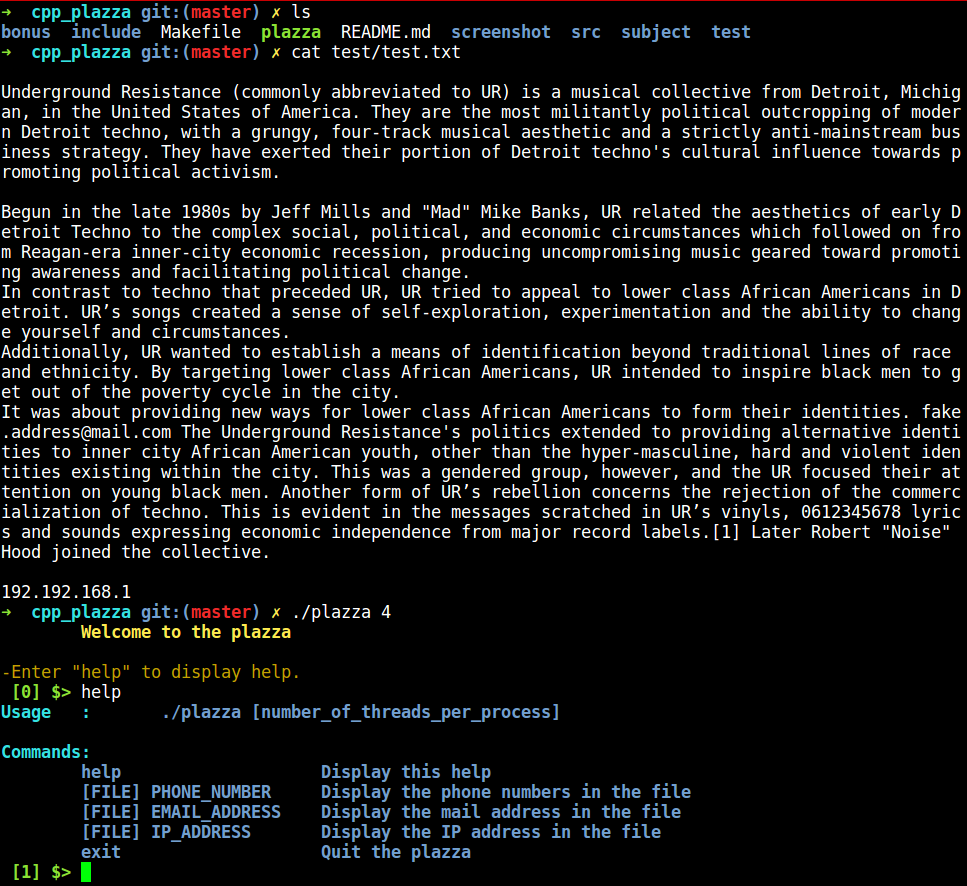
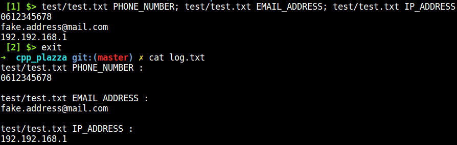

# cpp_plazza
Epitech second year project : cpp_plazza

First C++-II project

Deadline : 3 weeks

Beginning of the project : 09/04/2017, 23h00

Group size : 3 person

Contributor : 
  -collet_j
  -darrig_a

# cpp_plazza

The purpose of this project is to make you realize a scrapper, which is composed of a main program, with an user interface, that accepts new commands, of several process, themselves with several threads, themselves looking for mails inside several files.

## Getting started

These instructions will allow you to obtain a copy of the operational project on your local machine for development and testing purposes.

### Prerequisites

What do you need to install the software and how to install it?

```
gcc
boost
make
```

### Installation

Here's how to start the project on your computer

Clone and go in the directory cpp_plazza

Project compilation

```
make
```

Running project

```
./cpp_plazza [nb_of_threads]
```


## Screenshot




## Build with

* [C++](https://en.wikipedia.org/wiki/C%2B%2B)

## Auteurs

* **David Munoz** - [DavidMunoz-dev](https://github.com/davidmunoz-dev)
